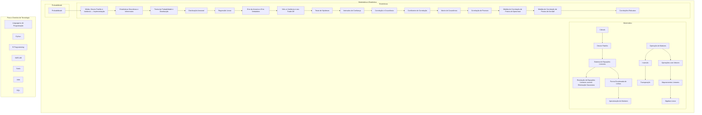

```mermaid
graph TD;

subgraph Matemática e Estatística
    subgraph Matemática
        a1[Cálculo]
        a2[Desvio Padrão]
        a3[Sistema de Equações Lineares]
        a4[Operação de Matrizes]
        a5[Inversão]
        a6[Transposição]
        a7[Resolução de Equações Lineares usando Eliminação Gaussiana]
        a8[Forma Escalonada de Linhas]
        a9[Aproximação de Matrizes]
        a10[Operações com Vetores]
        a11[Mapeamentos Lineares]
        a12[Álgebra Linear]
    end
    subgraph Probabilidade
        b1[Probabilidade]
    end
    subgraph Estatísticas
        c1[Média, Desvio Padrão e Variância — Implementação]
        c2[Estatísticas Descritivas e Inferenciais]
        c3[Teoria da Probabilidade e Distribuição]
        c4[Distribuição Amostral]
        c5[Regressão Linear]
        c6[Erro da Amostra e Erro Verdadeiro]
        c7[Viés vs Variância e seu Trade-Off]
        c8[Teste de Hipóteses]
        c9[Intervalos de Confiança]
        c10[Correlação e Covariância]
            d1[Coeficiente de Correlação]
            d2[Matriz de Covariância]
            d3[Correlação de Pearson]
            d4[Medida de Correlação de Postos de Spearman]
            d5[Medida de Correlação de Postos de Kendall]
            d6[Correlações Robustas]
    end
end

subgraph Para o Domínio de Tecnologia
    e1[Linguagens de Programação]
        f1[Python]
        f2[R Programming]
        f3[MATLAB]
        f4[Scala]
        f5[Julia]
        f6[SQL]
end

a1 --> a2 --> a3 --> a7;
a4 --> a5 --> a6;
a3 --> a8 --> a9;
a4 --> a10 --> a11 --> a12;
b1 --> c1 --> c2 --> c3 --> c4 --> c5 --> c6 --> c7 --> c8 --> c9 --> c10;
c10 --> d1 --> d2 --> d3 --> d4 --> d5 --> d6;
```