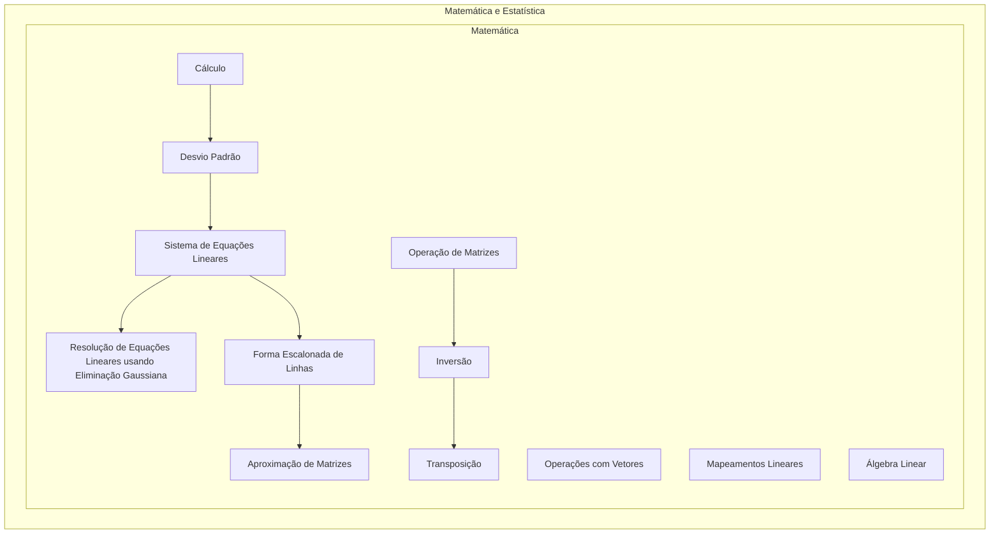

```mermaid
graph TD

subgraph Matemática e Estatística
    subgraph Matemática
        a1[Cálculo]
        a2[Desvio Padrão]
        a3[Sistema de Equações Lineares]
        a4[Operação de Matrizes]
        a5[Inversão]
        a6[Transposição]
        a7[Resolução de Equações Lineares usando Eliminação Gaussiana]
        a8[Forma Escalonada de Linhas]
        a9[Aproximação de Matrizes]
        a10[Operações com Vetores]
        a11[Mapeamentos Lineares]
        a12[Álgebra Linear]
    end
end
a1 --> a2 --> a3 --> a7;
a4 --> a5 --> a6;
a3 --> a8 --> a9;
```